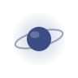
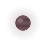
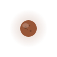
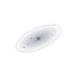
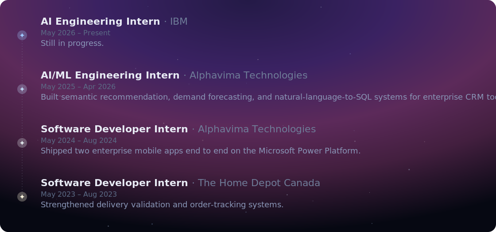

## ✨ Contributions

Each star is a day with a commit, bigger and warmer means more contributions that day.

## 🚀 Missions

<picture><source media="(prefers-color-scheme: dark)" srcset="./assets/planet-ringed-dark.svg"></picture><picture><source media="(prefers-color-scheme: dark)" srcset="./assets/asteroid-belt-dark.svg"></picture>  
**[Model Comparison Challenge](https://github.com/hia-aggrawal/CSC311_ml_challenge)**  
*Comparing KNN, decision trees, logistic regression, and neural networks on a shared prediction task.*  
Python · scikit-learn

<picture><source media="(prefers-color-scheme: dark)" srcset="./assets/planet-banded-dark.svg"></picture><picture><source media="(prefers-color-scheme: dark)" srcset="./assets/asteroid-belt-dark.svg"></picture>  
**[Ride-Sharing Simulation & Treemap Visualizer](https://github.com/hia-aggrawal/CSC148)**  
*An event-driven simulation of riders, drivers, and dispatch, alongside a recursive treemap visualizer.*  
Python · Data Structures

<picture><source media="(prefers-color-scheme: dark)" srcset="./assets/planet-cratered-dark.svg"></picture><picture><source media="(prefers-color-scheme: dark)" srcset="./assets/asteroid-belt-dark.svg"></picture>  
**[Audio Manipulation & Multiplayer Battle Server](https://github.com/hia-aggrawal/CSC209)**  
*Adding echo and removing vocals from WAV files, alongside a socket-based multiplayer battle server.*  
C · Unix · Sockets

<picture><source media="(prefers-color-scheme: dark)" srcset="./assets/planet-mooned-dark.svg"></picture><picture><source media="(prefers-color-scheme: dark)" srcset="./assets/asteroid-belt-dark.svg"></picture>  
**[Code Chronicles: A Wizard's Quest](https://github.com/hia-aggrawal/CSC207)**  
*A fantastical adventure game built with OOP and design patterns.*  
Java · Design Patterns

<picture><source media="(prefers-color-scheme: dark)" srcset="./assets/galaxy-spiral-dark.svg"></picture>  
*Coming soon*

<picture><source media="(prefers-color-scheme: dark)" srcset="./assets/galaxy-elliptical-dark.svg"></picture>  
*Coming soon*

## 🛠️ Skills

 
 

## 🔭 Field Notes

<picture><source media="(prefers-color-scheme: dark)" srcset="./assets/field-notes-constellation-dark.svg"></picture>

## 🧭 Expeditions

 
 

<picture><source media="(prefers-color-scheme: dark)" srcset="./assets/divider-sparkle-dark.svg"></picture>

<i>Still mapping the sky.</i>

<a href="mailto:hia.aggrawal@gmail.com"><picture><source media="(prefers-color-scheme: dark)" srcset="./assets/icon-mail-dark.svg"></picture></a>
&nbsp;&nbsp;
<a href="https://www.linkedin.com/in/hia-aggrawal-29b748227/"><picture><source media="(prefers-color-scheme: dark)" srcset="./assets/icon-linkedin-dark.svg"></picture></a>

