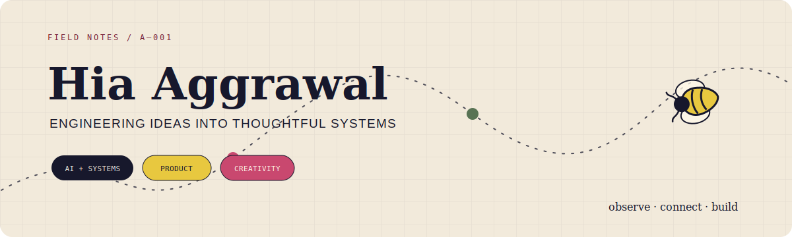
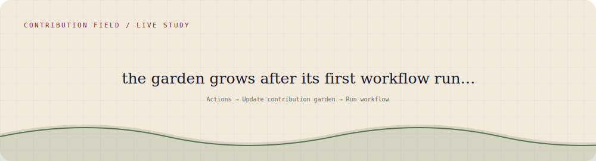

<div align="center">
  
</div>

<p align="center">
  <strong>Hi, I’m Hia.</strong> I turn tangled ideas into thoughtful software.<br/>
  Computer Science @ University of Toronto Mississauga · AI, systems, and product engineering
</p>

<br/>

### my contribution garden

<p align="center">
  
</p>

<p align="center"><sub>Every active day grows something. More contributions make a fuller patch. The garden redraws itself each morning.</sub></p>

<br/>

### things I’ve been growing

```text
01  an AI agent that maps goals → initiatives → opportunities
    Python · IBM watsonx · PostgreSQL · Docker

02  calmer, more resilient long-running AI workflows
    async jobs · retries · status and error states · context management

03  demand forecasts and recommendation systems for enterprise products
    Python · XGBoost · Azure Functions · machine learning pipelines

04  clearer delivery visibility and proof-of-delivery experiences
    enterprise software · product development · customer experience
```

<br/>

### notes from the margins

> 🌱 I like software that makes its state understandable.

> ✦ I care about the feeling of a product as much as the machinery underneath it.

> 🐝 Current curiosities: agent context, calm interfaces, and turning sketches into systems.

<br/>

<p align="center">
  <code>Python</code> · <code>React</code> · <code>PostgreSQL</code> · <code>Docker</code> · <code>AI agents</code> · <code>IBM watsonx</code>
</p>

<p align="center">
  <em>Part engineer, part artist, always making something.</em>
</p>

<!-- Add verified LinkedIn, email, résumé, and public project links here. -->
